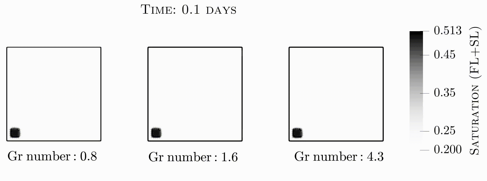

<center> <h1>Codes for a bound-preserving discontinuous Galerkin solver for incompressible two-phase flow problem </h1> </center>

Numerical examples for
> Mohammad. S. Joshaghani and Beatrice Riviere,
> ``Maximum-principle-satisfying discontinuous Galerkin methods for incompressible two-phase immiscible flow" Available in [arXiv](https://arxiv.org/abs/2106.11807).
> <details><summary>[Abstract]</summary>
><p> This paper proposes a fully implicit numerical scheme for immiscible incompressible two-phase flow in porous media taking into account gravity, capillary effects, and heterogeneity. The objective is to develop a fully implicit stable discontinuous Galerkin (DG) solver for this system that is accurate, bound-preserving, and locally mass conservative. To achieve this, we augment our DG formulation with post-processing flux and slope limiters. The proposed framework is applied to several benchmark problems and the discrete solutions are shown to be accurate, to satisfy the maximum principle and local mass conservation. 
></p>
></details>

In this repository, we have provided python computer codes for the numerical solution of immiscible two-phase flows in porous media,
which is obtained by augmenting interior penalty DG formulation with post-processing flux and slope limiters. 
The proposed method is accurate, robust, mesh-independent, mass-conservative, and maximum-principle satisfying.
This repo entails several examples of pressure-driven flow and quarter-five spot that account for gravity, capillary effects, 
and heterogeneity. More details are discussed in the paper.

## Notes on limiters
At each time step, following the Newton solver convergence, we first apply a new flux limiter and then a slope limiter. 
Implementation of the flux limiter algorithm is provided in the module ***FluxLimiter*** along with an auxiliary 
flux wrapper module named ***Hsign***. As for the slope limiter, we use the native ***VertexBasedLimiter*** module embedded in the 
Firedrake project.
## Representative results

<p align="center">
This video shows the evolution of saturation profile using DG scheme without limiter (left) and with the proposed limiters (right) for duration of 4500 s. The color mapping for the physical of range of 0.2 to 0.85 is grayscale, while values below and above bounds are colored blue and red, respectively. It is evident that DG approximation with no limiter yields noticeable violations, while the proposed limited DG scheme is capable of providing maximum-principle satisfying results. In spite of this, the front under both unlimited and limited DG, propagates with the same speed. For more details refer to section 4.2.3 of paper.
</p>


<p align="center">
Top row illustrates the permeability fields adopted from two horizontal layers of SPE10 
model 2 data-set. Layer 13 is taken from relatively smooth Tarbert formation, whereas layer 73 
is taken from a highly varying Upper-Ness formation. Values are presented in logarithmic scale. 
satisfying results at all time steps.
The video shows the evolution of the saturation obtained using DG+FL+SL scheme for 
layer 13 (bottom left) and layer 73 (bottom right). The simulation runs to T=1.374.
For both cases, the wetting phase moves toward the production well by sweeping the regions with 
highest permeability values. Another observation is that proposed limiters yield physical
values of saturation, without any overshoots and undershoots, even for domains with
permeabilities that vary over several orders of magnitudes. For more details refer to section 4.3.2 paper.
</p>



<p align="center">
This video shows saturation contours for duration of 11 days for different gravity numbers.
DG+FL+SL scheme is applied that leads to satisfactory results with respect to maximum principle.
By increasing the difference in phases density, gravitational force dominates the viscous force 
(from left to right). This results in more wetting phase saturation to be deposited at the bottom 
of domain and hence less non-wetting phase is recovered at the production well. 
For more details refer to section 4.4.2 of paper.
</p>

## Project tree
```
./Codes
├── Pressure_driven
│   ├── Barrier
│   │   ├── FD_Limited.py
│   │   ├── FD_mesh_noLimiter.py
│   │   ├── Limiter
│   │   │   ├── flux_limiter.py
│   │   │   └── hsign.py
│   │   └── mesh
│   │       ├── crack_3.geo
│   │       └── crack_3.msh
│   ├── Gravity
│   │   ├── FD_incompressible.py
│   │   └── Limiter
│   │       ├── flux_limiter.py
│   │       └── hsign.py
│   ├── Homogen
│   │   ├── Compare
│   │   │   ├── FD_incompressible_new.py
│   │   │   └── Limiter
│   │   │       ├── flux_limiter.py
│   │   │       └── hsign.py
│   │   └── NIPGvsUpwind
│   │       ├── FD_incompressible.py
│   │       └── Limiter
│   │           ├── flux_limiter.py
│   │           └── hsign.py
│   └── Nonhomogen
│       ├── FD_incompressible.py
│       └── Limiter
│           ├── flux_limiter.py
│           └── hsign.py
├── Quarter_five_spot
│   ├── Gravity
│   │   ├── FD_well_incompressible.py
│   │   └── Limiter
│   │       ├── flux_limiter_well.py
│   │       └── hsign.py
│   ├── Homogen
│   │   ├── FD_well_incompressible+SL.py
│   │   ├── FD_well_incompressible.py
│   │   ├── FD_well_incompressible_nolimiter.py
│   │   └── Limiter
│   │       ├── flux_limiter_well.py
│   │       └── hsign.py
│   └── SPE10
│       ├── FD_well_incompressible.py
│       └── Limiter
│           ├── flux_limiter_well.py
│           └── hsign.py
└── Verification
    ├── 1D_Buckley_Leverett
    │   ├── BL_Implicit.py
    │   └── Limiter
    │       ├── flux_limiter.py
    │       └── hsign.py
    ├── 2D_BUckley_Leverett
    │   ├── Implicit.py
    │   └── Limiter
    │       ├── flux_limiter.py
    │       └── hsign.py
    └── Convergence
        ├── DG+FL+SL.py
        ├── DG+FL+SL_avg.py
        ├── DG+FL.py
        ├── DG+SL.py
        ├── DG.py
        ├── DG_avg.py
        ├── Limiter
        │   ├── flux_limiter_well.py
        │   └── hsign.py
        ├── batch_DG+FL+SL.sh
        ├── batch_DG+FL+SL_avg.sh
        ├── batch_DG+FL.sh
        ├── batch_DG+SL.sh
        ├── batch_DG.sh
        ├── batch_DG_avg.sh
        └── rate.sh

27 directories, 50 files
```

